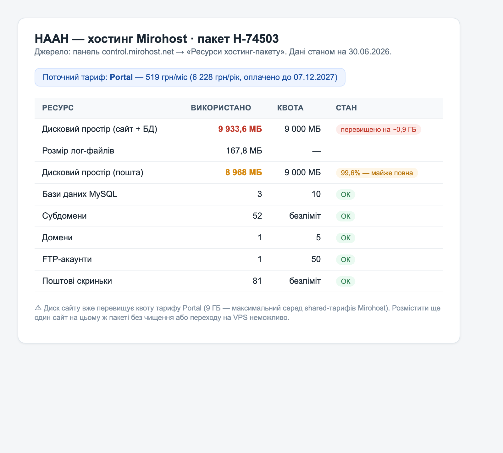

# Хостинг порталу НААН — поточний стан і варіанти

*Підготовлено для стейкхолдерів. Дані станом на 30.06.2026.*

---

## 1. Поточний стан

Сайт `naas.gov.ua` працює на shared-хостингу **Mirohost**, тариф **Portal** — 519 грн/міс (оплачено до 07.12.2027). Тариф фактично **вичерпано**:

| Ресурс                       |    Використано |    Квота | Стан                     |
| ---------------------------- | -------------: | -------: | ------------------------ |
| Дисковий простір (сайт + БД) | **9 933,6 МБ** | 9 000 МБ | ⛔ перевищено на ~0,9 ГБ |
| Дисковий простір (пошта)     |   **8 968 МБ** | 9 000 МБ | 🔴 99,6% — майже повна   |
| Бази даних MySQL             |              3 |       10 | ОК                       |
| Субдомени                    |             52 | безліміт | ОК                       |
| Поштові скриньки             |             81 | безліміт | ОК                       |

> Джерело: панель `control.mirohost.net` → «Ресурси хостинг-пакету».

## 2. Чому не можна розмістити новий портал на цьому тарифі

- **Місця немає.** Диск сайту вже перевищує квоту, пошта майже повна. Portal — найбільший shared-тариф Mirohost (вище немає).
- **Технічно не підходить.** Shared-хостинг працює **лише з PHP**. Новий портал побудовано в сучасній архітектурі — окремий React-фронтенд + окремий Node-бекенд, — який на shared-хостингу **не запускається**.

## 3. Що потрібно: окремий VPS

Під новий портал потрібен окремий **VPS** (старий сайт поки лишається на Portal). Є два варіанти:

| Варіант                                                           | Вартість                | Особливості                                            |
| ----------------------------------------------------------------- | ----------------------- | ------------------------------------------------------ |
| **Український VPS** (Mirohost eVPS-8 — 2 vCPU / 4 ГБ RAM / 49 ГБ) | 1 524 грн/міс — дорожче | простіше: дані в Україні, без погоджень                |
| **Європейський VPS** (напр. Hetzner, та сама конфігурація)        | ~391 грн/міс            | складніше: потрібні погодження (див. нижче), тимчасово |

## 4. Юридичний аспект: розміщення в ЄС

Держсайт `.gov.ua` за замовчуванням розміщують **в Україні**.

- **Закон № 3284-IX** (домен .gov.ua) забороняє розміщення лише на «ворожих» територіях — окупованих, у державі-агресорі, під санкціями. ЄС під заборону не підпадає.
- **Постанова КМУ № 1500** дозволяє розміщення за межами України як **виняток воєнного часу** — за умов: ресурс без службової інформації, **погодження СБУ**, шифрування даних, повідомлення Держспецзв'язку та Мінцифри; і лише на період воєнного стану + 6 місяців з подальшим поверненням в Україну.

Тобто Європа теоретично можлива, але потребує погоджень і є тимчасовою. Український хостинг знімає ці питання.

**Джерела:**
- Закон № 3284-IX: https://zakon.rada.gov.ua/laws/show/3284-20
- Постанова КМУ № 1500: https://zakon.rada.gov.ua/laws/show/1500-2022-%D0%BF#Text
- Правила домену GOV.UA: https://www.gov.ua/policy/
